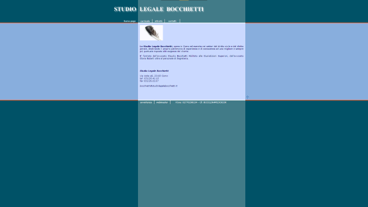
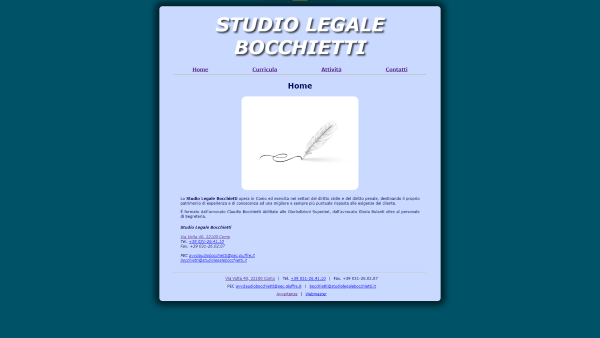

# Studio Legale Bocchietti Website

Code for the `Studio Legale Bocchietti` website, rewritten from scratch in one day.

Screenshot of the old version of the website

Screenshot of the new version of the website

## PHP Framework

The previous version of the website was written in `ASP.NET`, and it was clearly outdated.

Having the possiblity to rewrite the website from scratch, I decided to use the [LeafPHP](https://leafphp.dev/) micro-framework.
LeafPHP is a modern, fast and lightweight PHP micro-framework, and it was the perfect choice for this project.

## Website

`Studio Legale Bocchietti` is a law firm based in Italy, and the website is a showcase of their services and their team.
It's a fully static website, with no need for a database or a CMS.

You can visit the website at [studiolegalebocchietti.it](https://studiolegalebocchietti.it).

Have a nice coding day,

Tommaso :panda_face:
